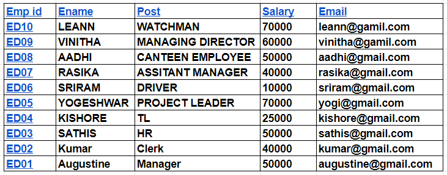
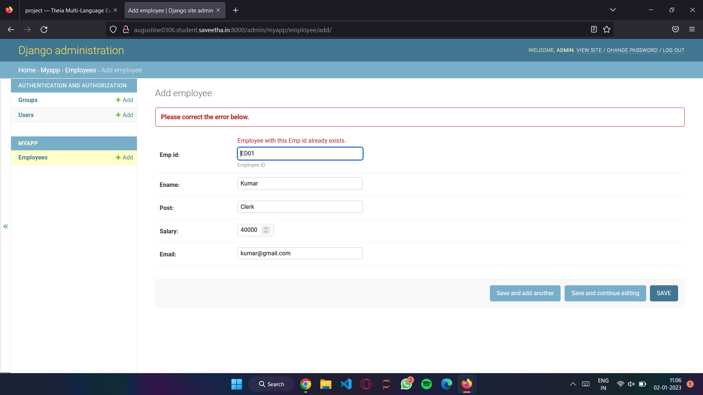
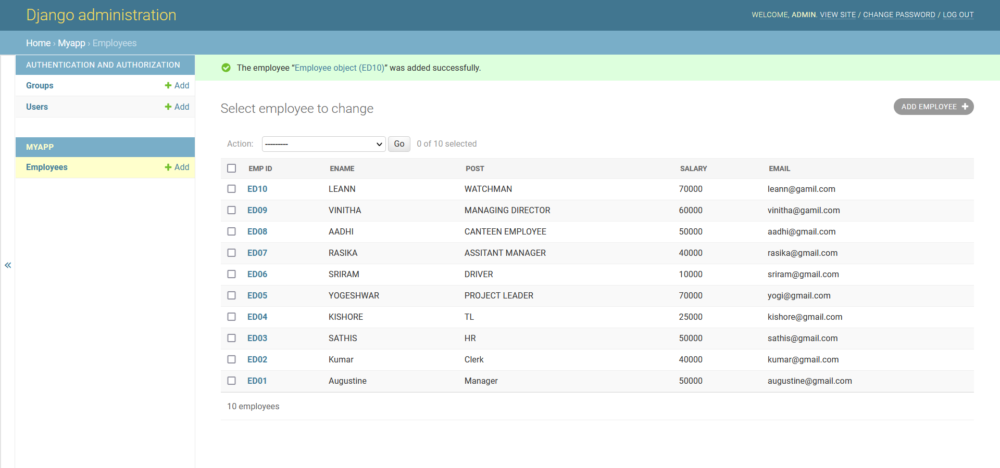

# Django ORM Web Application

## AIM
To develop a Django application to store and retrieve data from a database using Object Relational Mapping(ORM).

## Entity Relationship Diagram

## DESIGN STEPS

### STEP 1:
Create a project and inside the project folder, create an application using - django-admin startproject and django-admin startapp .Inside the applicaton folder, open setiings.py and allow all the hosts.

### STEP 2:
Now in the application folder, open models.py and write the code for your desired table here. Go to admin.py and migrate all your data.

### STEP 3:
On running the server, open the html page.Here you can add or get the desired data from the table you have created.

## PROGRAM
from django.contrib import admin
from .models import Employee,EmployeeAdmin

admin.site.register(Employee,EmployeeAdmin)

from django.db import models
from django.contrib import admin 

class Employee (models.Model):
    emp_id=models.CharField(primary_key=True ,max_length=4,help_text="Employee ID")
    ename=models.CharField(max_length=50)
    post=models.CharField(max_length=20)
    salary=models.IntegerField()
    email=models.EmailField()

class EmployeeAdmin(admin.ModelAdmin):
    list_display=('emp_id','ename','post','salary','email')  

Include your code here

## OUTPUT

## RESULT

In the end, you would have created a small database where you can store and retrieve your data using Objecct Realtional Mapping(ORM).
